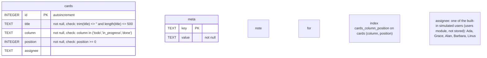

# Database schema

```mermaid
erDiagram
	cards {
		INTEGER id PK "autoincrement"
		TEXT title "not null, check: trim(title) <> '' and length(title) <= 500"
		TEXT column "not null, check: column in ('todo','in_progress','done')"
		INTEGER position "not null, check: position >= 0"
		TEXT assignee
	}
	meta {
		TEXT key PK
		TEXT value "not null"
	}
	note for cards "index cards_column_position on cards (column, position)"
	note for cards "assignee: one of the built-in simulated users (users module, not stored): Ada, Grace, Alan, Barbara, Linus"
```
